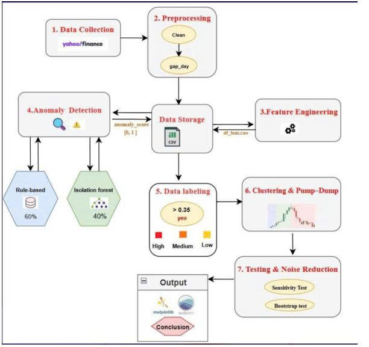

# Hybrid Anomaly Detection System for Stock Market Manipulation

## 📌 Overview

This project presents a **Hybrid Anomaly Detection System** designed to
identify potential stock market manipulation using a combination of
**rule-based financial heuristics** and **machine learning (Isolation
Forest)**.

The system aims to provide **real-time alerts**, improve **investment
decision-making**, and enhance **market transparency**.

## 🏗️ System Architecture

------------------------------------------------------------------------

## 🎯 Objectives

-   Detect abnormal stock behaviors (price spikes, unusual volume)
-   Warn investors before making risky decisions
-   Support financial analysis and research
-   Ensure balance between:
    -   Accuracy
    -   Speed
    -   Explainability

------------------------------------------------------------------------

## 🧠 Methodology

### 1. Rule-based Component

Uses financial indicators: - Daily Return - RSI (Relative Strength
Index) - Bollinger Bands - Volume Ratio

Example rule: - Volume ratio \> 1.8 - RSI \> 70 - Price breakout

### 2. Machine Learning Component

Model: **Isolation Forest** - Detects anomalies via tree-based
isolation - Works without labeled data (unsupervised)

**Input features (10D):** - Log-return - Volatility - RSI - MACD - ATR

------------------------------------------------------------------------

## ⚖️ Hybrid Scoring

Final score is computed as:

Score = 0.6 × Rule-based + 0.4 × ML-based

-   Rule-based → interpretable
-   ML → captures complex patterns

------------------------------------------------------------------------

## 🏗️ System Architecture

Pipeline: 1. Data Collection 2. Preprocessing 3. Feature Engineering 4.
Anomaly Detection 5. Scoring 6. Output Alerts

------------------------------------------------------------------------

## 📊 Performance

  Model               Precision   Recall      F1          ROC-AUC
  ------------------- ----------- ----------- ----------- -----------
  Isolation Forest    0.587       0.607       0.597       0.955
  Z-score             0.562       0.885       0.688       0.974
  **Hybrid System**   **0.700**   **0.803**   **0.748**   **0.983**

-   Best F1-score: **0.748**
-   Speed: **32.7 µs/sample**

------------------------------------------------------------------------

## ⚔️ Comparison with SOTA

Advantages: - Lower computational cost - Real-time capability - High
explainability - Works on standard hardware

------------------------------------------------------------------------

## 🌍 Use Cases

-   Retail investors
-   Financial analysts
-   Stock monitoring platforms
-   Cryptocurrency anomaly detection

------------------------------------------------------------------------

## ⚠️ Limitations

-   Fixed contamination rate in Isolation Forest
-   No market index normalization (e.g., VNIndex)

------------------------------------------------------------------------

## 🚀 Future Work

-   NLP sentiment analysis from news
-   Autoencoder-based models
-   Broader backtesting across sectors

------------------------------------------------------------------------

## 🏁 Conclusion

The hybrid approach provides: - High efficiency - Real-time processing -
Explainability - Scalability

------------------------------------------------------------------------

## 👥 Authors

FPT University Research Team
